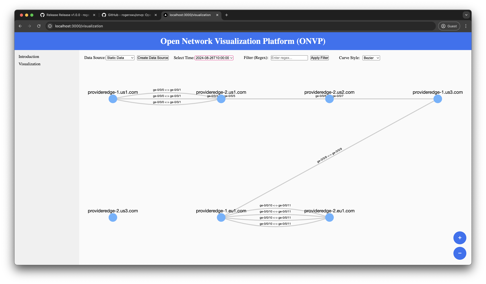

# Open Network Visualization Platform (ONVP)


<p align="center">
  
</p>

## What is ONVP?
The Open Network Visualization Platform (ONVP) is a web application designed to provide a better visualization for Layer 2 network connections. Built with flexibility and interactivity in mind, ONVP enables network engineers and IT professionals to effectively explore complex network topologies with ease. The platform offers a range of powerful features, including:

## Features
- Interactive Network Diagrams: ONVP presents a comprehensive Layer 2 network connection diagram that allows users to zoom in/out and freely move elements, making it easy to navigate and analyze complex topologies.
- Multiple Link Support: The platform supports rendering multiple links between two nodes, providing an accurate visual representation of network redundancy or multi-path configurations.
- Regex-Based Node Filtering: ONVP empowers users with advanced filtering capabilities by supporting regular expressions (regex) to match node hostnames, offering precise control over which nodes are displayed and analyzed.
- Flexible Link Display Modes: Users can toggle between modes to either display multiple links between two points or a single aggregated link, enhancing the versatility of the network visualization depending on the use case.
- Static Data Source Input: ONVP seamlessly integrates static data source files as input, ensuring compatibility with pre-existing network data and offering the ability to quickly load and visualize network information.
- Time-Based Topology Rendering: ONVP includes a feature to render network diagrams based on collected datetime data, allowing users to observe and compare topology changes over time. This makes it easier to track network evolution and quickly spot any alterations in the network's structure between different time periods.

## Usage

ONVP accept two data sources static file or api. For static file, replace the data in public/networkData.json. For API, place the API in components/network_diagram.js.

## Installation
1. Install docker, docker compose, node.js>20 before you run the following cmds
2. Run
```
MODE=dev docker compose up -d --build
```
Run in prod mode
```
MODE=prod docker compose up -d --build
```
Run locally
```
npm run build
npm start
```


## Contributing
We are open to contributions, before making a PR, please make sure you've read our [`CONTRIBUTING.md`](https://github.com/rogerxwu/onvp/blob/main/CONTRIBUTING.md) document.


